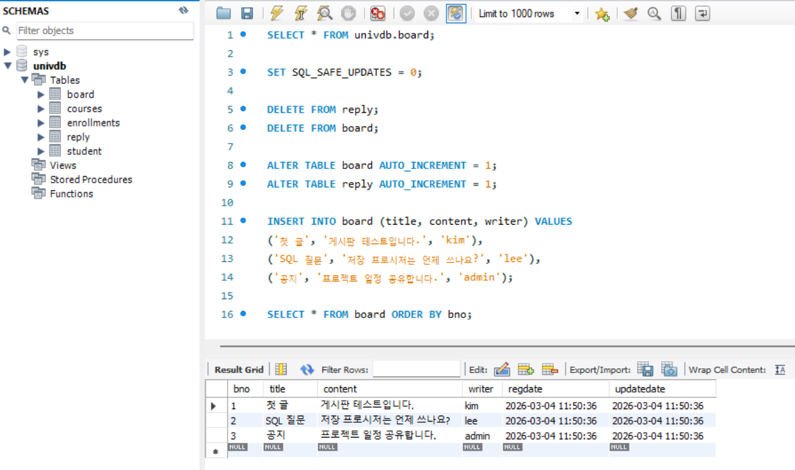
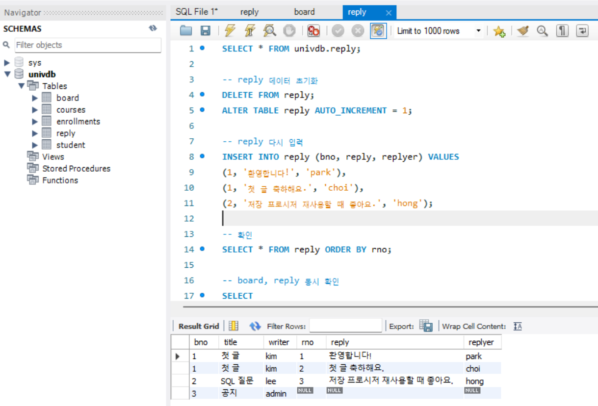

# SQL Board/Reply Assignment

## 프로젝트 목적
이 과제는 MySQL에서 게시글(`board`)과 댓글(`reply`)의 **1:N 관계 설계**를 직접 구현하고,
아래 핵심 SQL 기능을 실습하기 위해 작성했습니다.

- DDL: 테이블 생성 및 제약조건(PK/FK) 설정
- DML: 샘플 데이터 입력/초기화/재입력
- SELECT + LEFT JOIN: 게시글/댓글 통합 조회
- 무결성 이해: FK(`reply.bno -> board.bno`)와 `ON DELETE CASCADE` 동작 확인

즉, 단순 테이블 생성이 아니라 **관계형 데이터 모델링 + CRUD 흐름 + 조인 조회**를 한 번에 검증하는 것이 목표입니다.

## 작업 환경
- OS: Windows 11
- DBMS: MySQL Server 8.0
- Client Tool: MySQL Workbench 8.0 CE
- Schema: `univdb`

## 테이블 세팅
### 1) board
- `bno` INT, PK, AUTO_INCREMENT
- `title` VARCHAR(100), NOT NULL
- `content` VARCHAR(1000), NOT NULL
- `writer` VARCHAR(50), NOT NULL
- `regdate` DATETIME, DEFAULT `now()`
- `updatedate` DATETIME, DEFAULT `now()`

### 2) reply
- `rno` INT, PK, AUTO_INCREMENT
- `bno` INT, FK (`reply.bno -> board.bno`)
- `reply` VARCHAR(1000), NOT NULL
- `replyer` VARCHAR(50), NOT NULL
- `replydate` DATETIME, DEFAULT `now()`
- `updatedate` DATETIME, DEFAULT `now()`
- FK 옵션: `ON DELETE CASCADE`

## 동작 방식
1. `board`에 게시글 3건 입력 (`첫 글`, `SQL 질문`, `공지`)
2. `reply`에 댓글 3건 입력 (`bno`로 원글 연결)
3. `LEFT JOIN`으로 게시글+댓글 동시 조회
   - 댓글 없는 게시글도 함께 조회됨 (`LEFT JOIN` 특성)

## 실행 방법
1. MySQL Workbench에서 `board_reply.sql`을 실행
2. 필요 시 데이터 초기화 후 재입력
   - `SET SQL_SAFE_UPDATES = 0;`
   - `DELETE FROM reply;`
   - `DELETE FROM board;`
   - `ALTER TABLE board AUTO_INCREMENT = 1;`
   - `ALTER TABLE reply AUTO_INCREMENT = 1;`
3. 아래 조회문으로 결과 확인

```sql
SELECT
  b.bno, b.title, b.writer,
  r.rno, r.reply, r.replyer
FROM board b
LEFT JOIN reply r ON b.bno = r.bno
ORDER BY b.bno, r.rno;
```

## 실행 결과 캡처
### board 데이터 입력/조회


### reply 입력 + board/reply 조인 조회

